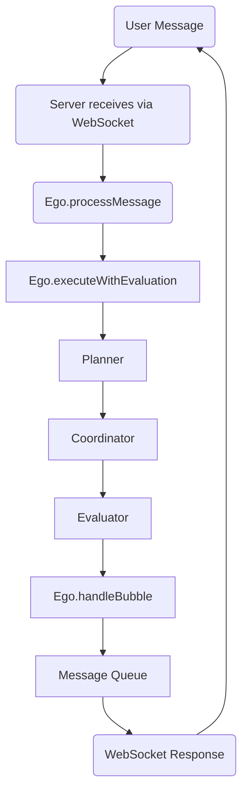

# Architecture

This document describes the internal architecture and operational flow of the LLM Agent. It is intended to provide context for understanding how the agent processes requests, makes decisions, and interacts with its environment and tools.

## 1. Core Architecture Overview

The agent is built upon a modular architecture with three primary layers:

*   **Ego Layer (`src/core/ego/`)**: The "brain" of the agent. It handles natural language understanding, orchestrates tasks, manages agent identity and personality, and interacts with the user.
*   **Coordinator Layer (`src/core/coordinator/`)**: Responsible for executing plans generated by the Planner. It invokes tools and manages the step-by-step execution of a task.
*   **Tool Layer (`src/mcp/`, `src/tools/`, `data/tools/`, `data/mcp-servers/`, `data/remote-mcp-servers/`)**: Provides the agent with its capabilities. This layer includes local JavaScript tools, local MCP (Model Context Protocol) servers, and remote MCP servers accessed via an SDK.

These layers communicate through well-defined interfaces and a shared event system.

## 2. Message Processing Flow

A typical interaction follows this general flow:

1.  **User Input**: The agent receives a message from the user (e.g., via WebSocket).
2.  **Ego Processing (`Ego.processMessage`)**:
    *   The message is stored in short-term memory.
    *   Relevant short-term and long-term memories are retrieved.
    *   An `enrichedMessage` is created, containing the original query and contextual information (identity, capabilities, memories).
3.  **Execution with Evaluation (`Ego.executeWithEvaluation`)**: This is a core loop:
    *   **Planning (`Planner`)**: An LLM call is made with the `enrichedMessage`, available tool descriptions, and memory to generate a step-by-step plan.
    *   **Coordination (`Coordinator`)**: The generated plan is executed. The Coordinator invokes the necessary tools via the `MCPToolManager`.
    *   **Evaluation (`Evaluator`)**: The results of the plan execution are evaluated by another LLM call against the original request and plan. This yields a score and recommendations.
    *   **Decision & Retry**:
        *   If the evaluation score meets a threshold (e.g., 80%) or max retries are reached, the Ego prepares a final response.
        *   If the score is low and retries are available, the Ego uses LLM-generated reflections on the evaluation feedback to adjust the context and re-attempts the planning and execution cycle.
4.  **Response Generation (`Ego.handleBubble`)**: The Ego uses an LLM to formulate a natural language response to the user based on the final execution result or error.
5.  **Output**: The response is sent back to the user.

Throughout this process, status updates and detailed logs are generated, and events are emitted via the `sharedEventEmitter`.

### Message Flow Diagram

## 3. Ego Layer (`src/core/ego/index.js`)

The Ego is the central orchestrator. Key responsibilities:

*   **Natural Language Understanding**: Interprets user messages.
*   **Task Orchestration**: Manages the lifecycle of a task from planning to final response.
*   **LLM Interaction**: Interfaces with the OpenAI API for planning, evaluation, reflection, and final response generation.
*   **Identity & Personality**: Manages the agent's persona using `personalityManager`.
*   **Evaluation Loop**: Drives the retry mechanism based on feedback from the `Evaluator`.
*   **Memory Interaction**: Stores user messages and execution results in short-term memory; retrieves relevant memories.
*   **Event Emission**: Emits `subsystemMessage` (e.g., `original_user_query`, `execution_start`, `evaluation_result`) and `systemStatusMessage` events.

### Reflection Subprocess

`Ego.handleBubble` triggers a reflection step after sending each response. The prompts in
`src/core/ego/reflection-prompts.js` instruct the LLM to analyse the latest
short‑term memory together with relevant long‑term memory and produce a JSON
object containing insights, lessons, follow-up questions and directives. These
results are stored in long‑term memory so the agent can adapt its future
behaviour.

## 4. Coordinator Layer (`src/core/coordinator/index.js`)

The Coordinator executes plans.

*   Receives a plan (a list of steps) from the Ego.
*   Iterates through each step in the plan.
*   For each step, identifies the required tool using `MCPToolManager.getTool()`.
*   Invokes the tool's `execute` method with the specified parameters.
*   Collects results from each step.
*   Handles errors during tool execution.
*   Can handle 'replan' requests from tools, triggering a new planning cycle.
*   Emits `subsystemMessage` with execution results or errors.

## 5. Planner Layer (`src/core/planner/index.js`)

The Planner generates a sequence of tool actions to fulfill the user's request.

*   Receives the `enrichedMessage` (containing user query, context, and memories) from the Ego.
*   Retrieves a list of all available tools and their descriptions from `MCPToolManager.getAllTools()`.
*   Constructs a detailed prompt for the LLM, including the user's request, tool descriptions, short-term memory, and relevant long-term memory. (Ensures memory objects are stringified before inclusion in prompts).
*   Calls the OpenAI API with a specific JSON schema (`PLAN_SCHEMA`) to ensure the output is a structured plan.
*   Validates that all tools specified in the generated plan are actually available.
*   Returns the plan (as a JSON string) to the Ego.
*   Emits `subsystemMessage` with the planning prompt and the generated plan.

## 6. Evaluator Layer (`src/core/evaluator/index.js`)

The Evaluator assesses the success of a plan's execution.

*   Receives the original user request, the executed plan, and the execution results from the Ego.
*   Constructs a prompt for the LLM to compare the outcome against the user's intent.
*   Calls the OpenAI API with a specific JSON schema (`EVALUATION_SCHEMA`) to get a structured evaluation, including:
    *   `score`: A numerical rating of success.
    *   `analysis`: A textual explanation of the score.
    *   `recommendations`: Suggestions for improvement if the task was not successful.
*   Returns the structured evaluation to the Ego.

## 7. Tool Layer

This layer provides the agent's action capabilities.

*   **`MCPToolManager` (`src/mcp/toolManager.js`)**:
    *   Acts as a central registry for all tools.
    *   Loads tools on initialization from multiple sources:
        *   **Local JavaScript Tools**: From `src/tools/` (core) and `data/tools/` (custom). These are JS modules exporting a standard tool interface (`name`, `description`, `getCapabilities`, `execute`).
        *   **Local MCP Servers (Stdio-based)**: Defined by configuration files in `data/mcp-servers/`. The manager uses `MCPClient` to spawn and communicate with these local server processes (e.g., Python scripts) via standard I/O.
        *   **Remote MCP Servers (HTTP SDK-based)**: Defined by configuration files in `data/remote-mcp-servers/`. The manager uses `MCPClient` to connect to these servers over HTTP, leveraging the `@modelcontextprotocol/sdk`.
    *   Provides `getAllTools()` for the Planner and `getTool()` for the Coordinator.
*   **`MCPClient` (`src/mcp/client.js`)**:
    *   Handles the low-level communication details for MCP servers.
    *   Manages connections to stdio-based child processes.
    *   Manages connections to remote HTTP servers using the `@modelcontextprotocol/sdk`, including handling streaming responses.
    *   Standardizes parameter parsing for tool calls.
*   **Tool Interface**: All tools, regardless of source, present a consistent interface to the agent, typically including `name`, `description`, and an `execute` method. Tool parameters are defined, often using JSON Schema.

## 8. Memory System (`src/core/memory/index.js`)

The Memory system allows the agent to retain and recall information.

*   **Storage Location**: Memory files are stored in the directory specified by `DATA_DIR_PATH` (defaulting to `PROJECT_ROOT/data`), under `memory/short/` and `memory/long/`.
*   **Short-Term Memory (`short_term.txt`)**:
    *   Stores recent interactions, user messages, and intermediate results within a session.
    *   Content is appended with context, module, and timestamp using `<MEMORY>` tags.
    *   Typically cleared at the start of a new session (`resetMemory`).
*   **Long-Term Memory (`long_term.txt`)**:
    *   Stores information intended for persistence across sessions.
    *   When storing, an LLM analyzes the content to generate a summary and relevant tags (`prompts.MEMORY_ANALYSIS_PROMPT`).
    *   When retrieving, an LLM selects the most relevant memories based on the query (`prompts.MEMORY_RETRIEVAL_PROMPT`). If short-term memory is available, it is appended to the question so retrieval considers the recent conversation context.
*   **Event Emission**: Emits `subsystemMessage` events (with module ID 'ego') for memory operations like retrieval, analysis, and categorization, providing transparency into its workings.

## 9. Event System (`src/utils/eventEmitter.js`)

A shared `EventEmitter` instance (`sharedEventEmitter`) facilitates decoupled communication between modules. Key events include:

*   `assistantResponse`: Carries the final response for the user.
*   `debugResponse`: For detailed debugging information.
*   `systemStatusMessage`: For brief status updates displayed to the user.
*   `subsystemMessage`: Provides detailed insights into the internal state and operations of different modules (Ego, Planner, Coordinator, Memory), often including prompts, results, and errors.
*   `systemError`: For reporting errors that occur within different parts of the system.
*   `bubble`: Used by Ego to handle final output formatting.

## 10. Configuration

*   **`.env` file**: Used for environment variables (e.g., API keys).
*   **`LLM_AGENT_DATA_DIR`**: Environment variable to specify the absolute path for the data directory. If not set or invalid, defaults to `PROJECT_ROOT/data`. This directory stores custom tools, personalities, MCP server configs, memory files, and logs.
*   **Personalities**: Configured in `personalities/` directory.
*   **Tool Configurations**: For MCP servers, JSON files in `data/mcp-servers/` and `data/remote-mcp-servers/`.

### Prompt Overrides

You can override any built-in prompt template by placing a text file in
`data/prompts/<module>/<PROMPT_NAME>.txt`. When `usePromptOverrides` is enabled
in `data/settings.json`, the system will load these files instead of the baked
in versions. If an override is missing or fails to load, the default prompt will
be used automatically.

## 11. Key Interactions & Loops

*   **Ego's Execution & Evaluation Loop**: The core control flow where the Ego directs planning, execution, and evaluation, with the possibility of retrying based on the evaluation score and adjustment insights.
*   **Planner-ToolManager Interaction**: Planner gets available tools from ToolManager to inform plan generation.
*   **Coordinator-ToolManager Interaction**: Coordinator uses ToolManager to get specific tool instances for execution.
*   **Memory-LLM Interaction**: Memory system uses LLM calls for analyzing content for long-term storage (summarization, tagging) and for selecting relevant long-term memories during retrieval.

This model provides a snapshot of the agent's internal workings, designed to be a reference for development and for the agent's own contextual understanding.