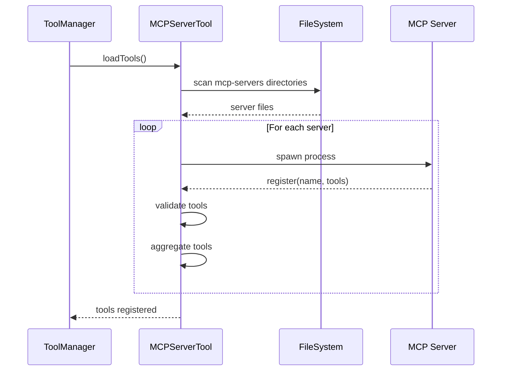
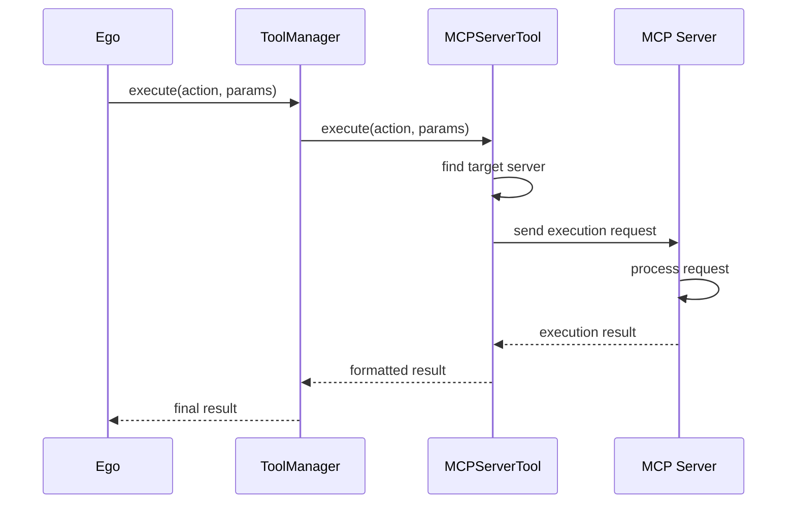
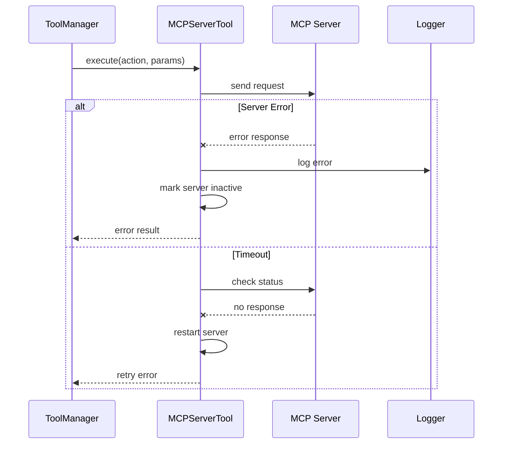
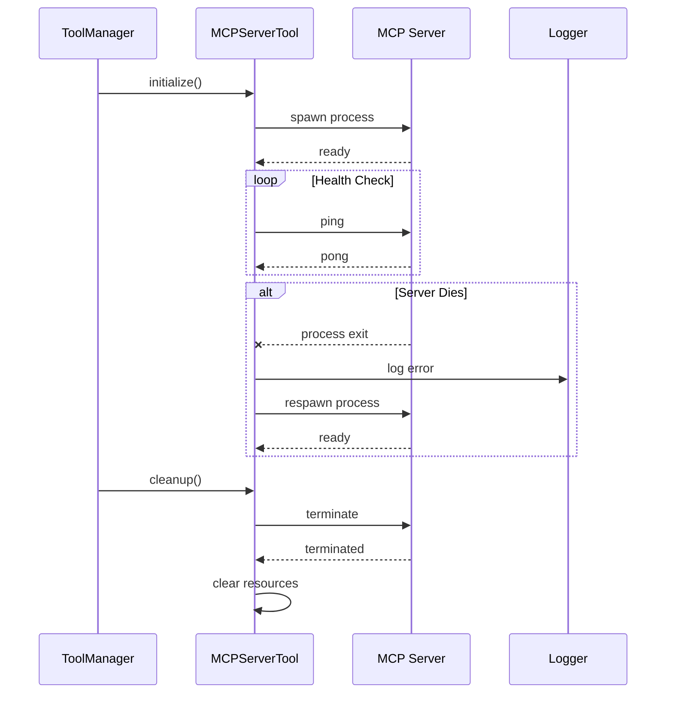
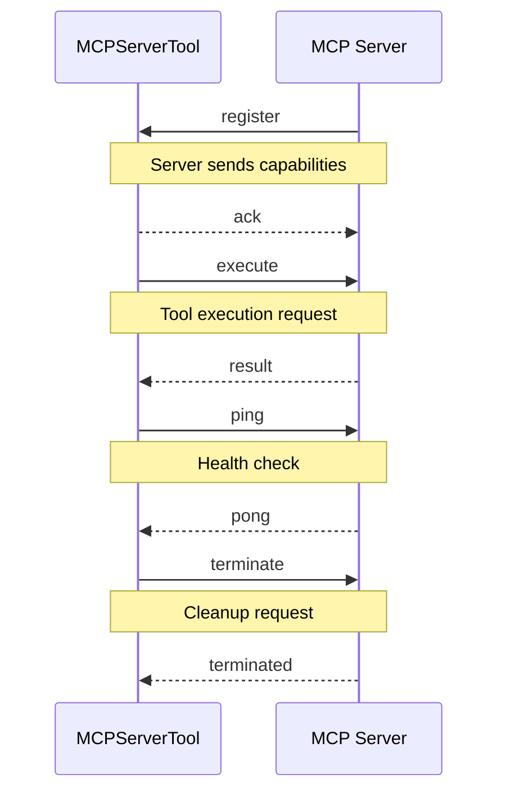
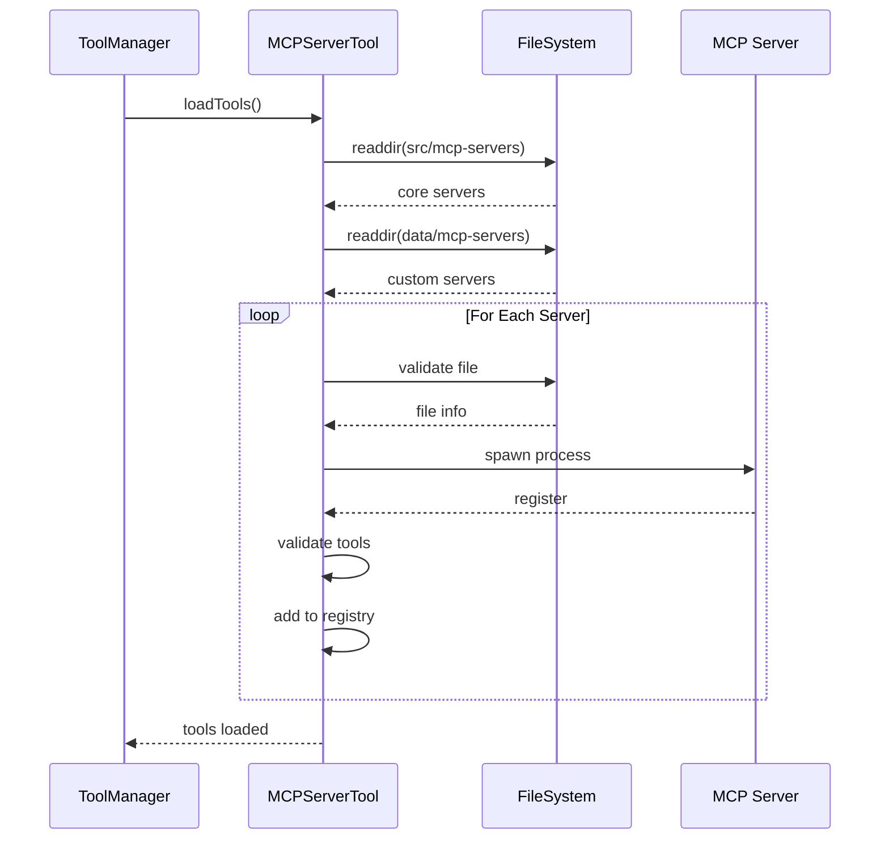

# MCP Client Sequence Flows

## Tool Loading Sequence

## Tool Execution Sequence

## Error Handling Sequence

## Server Lifecycle Sequence

## Message Protocol Sequence

## Tool Discovery Sequence

